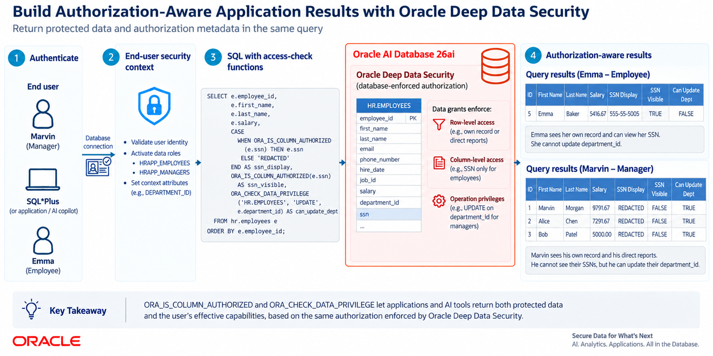

# How Can Access-Check Functions Build Authorization-Aware Application Results?

## What You Will Learn

This **Oracle Deep Data Security LiveLabs FastLab** shows how an application or AI-copilot backend can return protected data with authorization metadata. You will use the `ORA_IS_COLUMN_AUTHORIZED` and `ORA_CHECK_DATA_PRIVILEGE` SQL functions with end users, data roles, and data grants.

The lab uses the same HR scenario as the **Getting Started with Oracle Deep Data Security** FastLab. Emma is an employee and Marvin is her manager. Both query the same HR.EMPLOYEES table, but their data grants return different rows and columns.

The core lab uses direct `ORA_END_USER_CONTEXT.username` predicates and stops at the SQL result consumed by a dashboard, API, or AI copilot. An optional section replaces those predicates with SQL Macros without changing the access-check queries.

Estimated Time: 15 minutes

## The Challenge

Deep Data Security can return NULL for an unauthorized column, which an application cannot distinguish from a stored NULL without checking authorization. Applications also need capability flags before showing actions such as **Edit**, **Delete**, or **Approve**. This lab returns employee data with safe display values and row and column flags for a manager dashboard or HR copilot.

The access-check functions solve these problems at query time:

- `ORA_IS_COLUMN_AUTHORIZED` distinguishes an authorized column value from an unauthorized NULL.
- `ORA_CHECK_DATA_PRIVILEGE` checks row-level and, optionally, column-level authorization for SELECT, INSERT, UPDATE, or DELETE.

They report authorization enforced by Deep Data Security; they do not replace data grants.

## How the Access Check Functions Work

### `ORA_IS_COLUMN_AUTHORIZED`

`ORA_IS_COLUMN_AUTHORIZED`(`column_reference` [, privilege]) returns TRUE when the current end user can access the current row's column value, or when the column is unprotected. The default privilege is SELECT. Use a column reference, qualify it when needed, and use this function before replacing an unauthorized NULL with a placeholder.

### `ORA_CHECK_DATA_PRIVILEGE`

`ORA_CHECK_DATA_PRIVILEGE`(object, privilege [, `column_reference`]) returns TRUE when the privilege is granted for the current row and, when specified, the column. The object can be schema-qualified or a table alias. It supports SELECT, INSERT, UPDATE, and DELETE; the column argument cannot be used with DELETE. Use it to expose effective capabilities.

### The Trust Chain

The functions inspect the same authorization state enforced by the data grants:

**End user authentication → data role → data grant → access-check result**

The lab uses password-based end-user authentication; the same checks work with identity supplied by an enterprise identity provider.

## Prerequisites

To follow along, you need:

- An **Oracle AI Database 26ai** instance
- A DBA account or a dedicated Deep Data Security administrator
- SQL*Plus, SQLcl, or another SQL client

The lab is self-contained. If you completed **Getting Started with Oracle Deep Data Security**, skip Tasks 0 through 4 and begin with Task 5.

## Task 0: Create a Deep Data Security Administrator (Optional)

For a least-privilege administrator, run the following as a database user with the required privileges.

~~~sql
<copy>
CREATE USER deepsec_admin IDENTIFIED BY Oracle123;

-- Standard Oracle privileges
GRANT CREATE SESSION TO deepsec_admin WITH ADMIN OPTION;
GRANT CREATE USER TO deepsec_admin;
GRANT ALTER USER TO deepsec_admin;
GRANT DROP USER TO deepsec_admin;
GRANT CREATE ANY TABLE TO deepsec_admin;
GRANT CREATE ANY VIEW TO deepsec_admin;
GRANT INSERT ANY TABLE TO deepsec_admin;
GRANT SELECT ANY TABLE TO deepsec_admin;
GRANT CREATE ANY INDEX TO deepsec_admin;
GRANT CREATE ROLE TO deepsec_admin;
GRANT DROP ANY ROLE TO deepsec_admin;
GRANT GRANT ANY ROLE TO deepsec_admin;
GRANT SELECT_CATALOG_ROLE TO deepsec_admin;

-- Deep Data Security privileges
GRANT CREATE END USER TO deepsec_admin;
GRANT DROP END USER TO deepsec_admin;
GRANT CREATE DATA ROLE TO deepsec_admin;
GRANT DROP DATA ROLE TO deepsec_admin;
GRANT GRANT ANY DATA ROLE TO deepsec_admin;
GRANT CREATE ANY DATA GRANT TO deepsec_admin;
GRANT DROP ANY DATA GRANT TO deepsec_admin;
GRANT ADMINISTER ANY DATA GRANT TO deepsec_admin;
</copy>
~~~

Connect as `deepsec_admin` for Tasks 1 through 7. Task 8 requires a DBA user or an administrator with the SET USE DATA GRANTS ONLY privilege.

## Task 1: Create the HR Schema and Employee Data

Create an HR schema, sample employee data, and a manager lookup table. The database must return only data each end user is authorized to see.

> **Connection:** Run as a DBA user or your Deep Data Security administrator.

1. Create a schema-only account for the HR data and grant it tablespace quota.

   CREATE USER hr NO AUTHENTICATION creates a schema that owns tables and objects but cannot be used to connect directly to the database.

   ~~~sql
   <copy>
   CREATE USER hr NO AUTHENTICATION DEFAULT TABLESPACE users;
   ALTER USER hr QUOTA UNLIMITED ON users;
   </copy>
   ~~~

2. Create the EMPLOYEES table and sample data. The MANAGERS lookup table maps employees to managers.

   ~~~sql
   <copy>
   CREATE TABLE hr.employees (
     employee_id   NUMBER PRIMARY KEY,
     first_name    VARCHAR2(50),
     last_name     VARCHAR2(50),
     job_code      VARCHAR2(10),
     department_id NUMBER,
     ssn           VARCHAR2(20),
     photo         BLOB,
     phone_number  VARCHAR2(30),
     salary        NUMBER(10,2),
     user_name     VARCHAR2(128),
     manager_id    NUMBER);

   -- CEO
   INSERT INTO hr.employees VALUES
     (1, 'Grace', 'Young', 'CEO', NULL, '111-11-1111', NULL,
      '555-100-0001', 235000, 'grace', NULL);

   -- Manager
   INSERT INTO hr.employees VALUES
     (2, 'Marvin', 'Morgan', 'SWE_MGR', 1, '222-22-2222', NULL,
      '555-100-0002', 175000, 'marvin', 1);

   -- Software engineering team
   INSERT INTO hr.employees VALUES
     (3, 'Emma', 'Baker', 'SWE2', 1, '333-33-3333', NULL,
      '555-100-0003', 120000, 'emma', 2);
   INSERT INTO hr.employees VALUES
     (4, 'Charlie', 'Davis', 'SWE1', 1, '444-44-4444', NULL,
      '555-100-0004', 95000, 'charlie', 2);
   INSERT INTO hr.employees VALUES
     (5, 'Dana', 'Lee', 'SWE3', 1, '555-55-5555', NULL,
      '555-100-0005', 130000, 'dana', 2);

   -- Other departments
   INSERT INTO hr.employees VALUES
     (6, 'Bob', 'Smith', 'SALES_REP', 2, '666-66-6666', NULL,
      '555-100-0006', 145000, 'bob', 1);
   INSERT INTO hr.employees VALUES
     (7, 'Fiona', 'Chen', 'HR_REP', 3, '777-77-7777', NULL,
      '555-100-0007', 92000, 'fiona', 1);

   CREATE TABLE hr.managers (
     manager_id     NUMBER,
     employee_id    NUMBER,
     mgr_user_name  VARCHAR2(128),
     mgr_first_name VARCHAR2(50),
     mgr_last_name  VARCHAR2(50));

   INSERT INTO hr.managers
     (manager_id, employee_id, mgr_user_name, mgr_first_name, mgr_last_name)
   SELECT e.manager_id,
          e.employee_id,
          m.user_name,
          m.first_name,
          m.last_name
     FROM hr.employees e
     JOIN hr.employees m
       ON e.manager_id = m.employee_id
    WHERE e.manager_id IS NOT NULL;

   COMMIT;
   </copy>
   ~~~

3. Verify the data.

   ~~~sql
   <copy>
   SELECT employee_id, first_name, last_name, user_name, ssn, salary
     FROM hr.employees
    ORDER BY employee_id;
   </copy>
   ~~~

   | `EMPLOYEE_ID` | `FIRST_NAME` | `LAST_NAME` | `USER_NAME` | SSN | SALARY |
   |---|---|---|---|---|---:|
   | 1 | Grace | Young | grace | 111-11-1111 | 235000 |
   | 2 | Marvin | Morgan | marvin | 222-22-2222 | 175000 |
   | 3 | Emma | Baker | emma | 333-33-3333 | 120000 |
   | 4 | Charlie | Davis | charlie | 444-44-4444 | 95000 |
   | 5 | Dana | Lee | dana | 555-55-5555 | 130000 |
   | 6 | Bob | Smith | bob | 666-66-6666 | 145000 |
   | 7 | Fiona | Chen | fiona | 777-77-7777 | 92000 |
   {: title="All employees"}

## Task 2: Create Emma and Marvin

Create Emma and Marvin as Oracle Database end users.

> **Connection:** Run as a DBA user or your Deep Data Security administrator.

~~~sql
<copy>
CREATE END USER emma IDENTIFIED BY Oracle123;
CREATE END USER marvin IDENTIFIED BY Oracle123;
</copy>
~~~

## Task 3: Create Database Roles and Data Roles

> **Connection:** Run as a DBA user or your Deep Data Security administrator.

1. Create a database role that grants CREATE SESSION.

   ~~~sql
   <copy>
   CREATE ROLE direct_logon_role;
   GRANT CREATE SESSION TO direct_logon_role;
   </copy>
   ~~~

2. Create the data roles.

   ~~~sql
   <copy>
   CREATE DATA ROLE HRAPP_EMPLOYEES;
   CREATE DATA ROLE HRAPP_MANAGERS;
   </copy>
   ~~~

3. Grant the appropriate data roles to Emma and Marvin.

   ~~~sql
   <copy>
   GRANT DATA ROLE HRAPP_EMPLOYEES TO emma;
   GRANT DATA ROLE HRAPP_EMPLOYEES TO marvin;
   GRANT DATA ROLE HRAPP_MANAGERS TO marvin;
   </copy>
   ~~~

4. Grant the database role to the employee data role.

   ~~~sql
   <copy>
   GRANT direct_logon_role TO HRAPP_EMPLOYEES;
   </copy>
   ~~~

5. Verify the role grants.

   ~~~sql
   <copy>
   SELECT data_role, role_type, grantee, grantee_type
     FROM dba_data_role_grants
    WHERE grantee IN ('EMMA', 'MARVIN', 'HRAPP_EMPLOYEES')
    ORDER BY data_role, grantee;
   </copy>
   ~~~

   | `DATA_ROLE` | `ROLE_TYPE` | GRANTEE | `GRANTEE_TYPE` |
   |---|---|---|---|
   | `HRAPP_EMPLOYEES` | DATA ROLE | EMMA | END USER |
   | `HRAPP_EMPLOYEES` | DATA ROLE | MARVIN | END USER |
   | `HRAPP_MANAGERS` | DATA ROLE | MARVIN | END USER |
   | `DIRECT_LOGON_ROLE` | DATABASE ROLE | `HRAPP_EMPLOYEES` | DATA ROLE |
   {: title="Data role grants"}

## Task 4: Create Simple Data Grant Predicates

Start with direct predicates so the row and column authorization model stays visible.

> **Connection:** Run as a DBA user or your Deep Data Security administrator.

1. Give employees access to their own row and allow them to update their phone number and first name.

   ~~~sql
   <copy>
   CREATE OR REPLACE DATA GRANT hr.HRAPP_EMPLOYEE_ACCESS
     AS SELECT, UPDATE(phone_number, first_name)
     ON hr.employees
     WHERE upper(user_name) = upper(ORA_END_USER_CONTEXT.username)
     TO HRAPP_EMPLOYEES;
   </copy>
   ~~~

2. Give managers access to their direct reports while excluding SSNs from the manager grant. Managers can update salary, department, and first name for those rows.

   ~~~sql
   <copy>
   CREATE OR REPLACE DATA GRANT hr.HRAPP_MANAGER_ACCESS
     AS SELECT (ALL COLUMNS EXCEPT ssn),
        UPDATE (salary, department_id, first_name)
     ON hr.employees
     WHERE manager_id IN
       (SELECT m.manager_id
          FROM hr.managers m
         WHERE upper(m.mgr_user_name) =
               upper(ORA_END_USER_CONTEXT.username))
     TO HRAPP_MANAGERS;
   </copy>
   ~~~

3. Verify the data grant predicates.

   ~~~sql
   <copy>
   SELECT DISTINCT grant_name, predicate
     FROM dba_data_grants
    WHERE object_owner = 'HR'
      AND object_name = 'EMPLOYEES'
    ORDER BY grant_name;
   </copy>
   ~~~

   | `GRANT_NAME` | PREDICATE |
   |---|---|
   | `HRAPP_EMPLOYEE_ACCESS` | `upper(user_name) = upper(ORA_END_USER_CONTEXT.username)` |
   | `HRAPP_MANAGER_ACCESS` | `manager_id IN (SELECT m.manager_id FROM hr.managers m WHERE upper(m.mgr_user_name) = upper(ORA_END_USER_CONTEXT.username))` |
   {: title="Simple data grant predicates"}

## Task 5: Check Column Authorization as Emma

`ORA_IS_COLUMN_AUTHORIZED` distinguishes an unauthorized NULL from a real NULL.

1. Connect as Emma.

   ~~~sql
   <copy>
   sqlplus emma/Oracle123@hrdb
   </copy>
   ~~~

2. Confirm the current end-user identity.

   ~~~sql
   <copy>
   SELECT ORA_END_USER_CONTEXT.username
     FROM dual;
   </copy>
   ~~~

   ~~~
   USERNAME
   --------------------------------------------------------------------------------
   "EMMA"
   ~~~

3. Query the SSN directly.

   ~~~sql
   <copy>
   SELECT employee_id, first_name, ssn
     FROM hr.employees
    ORDER BY employee_id;
   </copy>
   ~~~

   Emma sees her own row and her own SSN.

   | `EMPLOYEE_ID` | `FIRST_NAME` | SSN |
   |---:|---|---|
   | 3 | Emma | 333-33-3333 |
   {: title="Emma can see her own SSN"}

4. Use `ORA_IS_COLUMN_AUTHORIZED` to expose the authorization state.

   ~~~sql
   <copy>
   SELECT employee_id,
          first_name,
          DECODE(
            ORA_IS_COLUMN_AUTHORIZED(ssn),
            FALSE, 'UNAUTHORIZED',
            TRUE,  ssn) AS ssn_for_display,
          ORA_IS_COLUMN_AUTHORIZED(ssn) AS ssn_authorized
     FROM hr.employees
    ORDER BY employee_id;
   </copy>
   ~~~

   Emma sees:

   | `EMPLOYEE_ID` | `FIRST_NAME` | `SSN_FOR_DISPLAY` | `SSN_AUTHORIZED` |
   |---:|---|---|---|
   | 3 | Emma | 333-33-3333 | TRUE |
   {: title="Column authorization for Emma"}

   The function returns TRUE because Emma's data grant authorizes SSN. Applications should use this result, not a NULL test, when substituting a placeholder.

5. Check the privilege for a column other than SELECT.

   Emma can update her phone number but not her salary.

   ~~~sql
   <copy>
   SELECT first_name,
          ORA_IS_COLUMN_AUTHORIZED(phone_number, 'UPDATE')
            AS phone_update_authorized,
          ORA_IS_COLUMN_AUTHORIZED(salary, 'UPDATE')
            AS salary_update_authorized
     FROM hr.employees;
   </copy>
   ~~~

   | `FIRST_NAME` | `PHONE_UPDATE_AUTHORIZED` | `SALARY_UPDATE_AUTHORIZED` |
   |---|---|---|
   | Emma | TRUE | FALSE |
   {: title="Column update authorization for Emma"}

## Task 6: Check Data Privileges as Emma

`ORA_CHECK_DATA_PRIVILEGE` allows an application to determine which actions are available for each current row.

1. Check Emma's row-level and column-level privileges.

   ~~~sql
   <copy>
   SELECT first_name,
          ORA_CHECK_DATA_PRIVILEGE(emp, 'SELECT')
            AS can_view_row,
          ORA_CHECK_DATA_PRIVILEGE(emp, 'UPDATE', phone_number)
            AS can_update_phone,
          ORA_CHECK_DATA_PRIVILEGE(emp, 'UPDATE', salary)
            AS can_update_salary,
          ORA_CHECK_DATA_PRIVILEGE(emp, 'DELETE')
            AS can_delete_row
     FROM hr.employees emp;
   </copy>
   ~~~

   | `FIRST_NAME` | `CAN_VIEW_ROW` | `CAN_UPDATE_PHONE` | `CAN_UPDATE_SALARY` | `CAN_DELETE_ROW` |
   |---|---|---|---|---|
   | Emma | TRUE | TRUE | FALSE | FALSE |
   {: title="Emma's effective privileges"}

2. An API can use these flags to display edit or delete actions. The database remains authoritative; changing the flags or SQL cannot grant access.

3. Verify the result with attempted updates. The phone update succeeds; the salary update affects no rows.

   ~~~sql
   <copy>
   UPDATE hr.employees
      SET phone_number = '555-555-5555'
    WHERE first_name = 'Emma';

   ROLLBACK;

   UPDATE hr.employees
      SET salary = 200000
    WHERE first_name = 'Emma';

   ROLLBACK;
   </copy>
   ~~~

## Task 7: Check Both Functions as Marvin

Marvin has both employee and manager data grants.

1. Connect as Marvin.

   ~~~sql
   <copy>
   sqlplus marvin/Oracle123@hrdb
   </copy>
   ~~~

2. Display SSNs safely.

   ~~~sql
   <copy>
   SELECT employee_id,
          first_name,
          DECODE(
            ORA_IS_COLUMN_AUTHORIZED(ssn),
            FALSE, 'UNAUTHORIZED',
            TRUE,  ssn) AS ssn_for_display,
          ORA_IS_COLUMN_AUTHORIZED(ssn) AS ssn_authorized
     FROM hr.employees
    ORDER BY employee_id;
   </copy>
   ~~~

   Marvin sees his own SSN, but the SSNs for his direct reports are unauthorized:

   | `EMPLOYEE_ID` | `FIRST_NAME` | `SSN_FOR_DISPLAY` | `SSN_AUTHORIZED` |
   |---:|---|---|---|
   | 2 | Marvin | 222-22-2222 | TRUE |
   | 3 | Emma | UNAUTHORIZED | FALSE |
   | 4 | Charlie | UNAUTHORIZED | FALSE |
   | 5 | Dana | UNAUTHORIZED | FALSE |
   {: title="Marvin's column authorization results"}

   The manager grant excludes SSN; the employee grant still exposes Marvin's own SSN.

3. Display Marvin's row and column capabilities.

   ~~~sql
   <copy>
   SELECT first_name,
          ORA_CHECK_DATA_PRIVILEGE(emp, 'SELECT')
            AS can_view_row,
          ORA_CHECK_DATA_PRIVILEGE(emp, 'UPDATE', phone_number)
            AS can_update_phone,
          ORA_CHECK_DATA_PRIVILEGE(emp, 'UPDATE', salary)
            AS can_update_salary,
          ORA_CHECK_DATA_PRIVILEGE(emp, 'DELETE')
            AS can_delete_row
     FROM hr.employees emp
    ORDER BY employee_id;
   </copy>
   ~~~

   | `FIRST_NAME` | `CAN_VIEW_ROW` | `CAN_UPDATE_PHONE` | `CAN_UPDATE_SALARY` | `CAN_DELETE_ROW` |
   |---|---|---|---|---|
   | Marvin | TRUE | TRUE | FALSE | FALSE |
   | Emma | TRUE | FALSE | TRUE | FALSE |
   | Charlie | TRUE | FALSE | TRUE | FALSE |
   | Dana | TRUE | FALSE | TRUE | FALSE |
   {: title="Marvin's effective privileges"}

   Marvin can update his phone through the employee grant and direct-report salaries through the manager grant, but not their phone numbers.

4. Check the same privileges with direct aliases and use the results in an application-style query.

   ~~~sql
   <copy>
   SELECT e.employee_id,
          e.first_name,
          e.last_name,
          DECODE(
            ORA_IS_COLUMN_AUTHORIZED(e.ssn),
            FALSE, 'UNAUTHORIZED',
            TRUE,  e.ssn) AS ssn_for_display,
          ORA_CHECK_DATA_PRIVILEGE(e, 'SELECT') AS can_view,
          ORA_CHECK_DATA_PRIVILEGE(e, 'UPDATE', phone_number)
            AS can_update_phone,
          ORA_CHECK_DATA_PRIVILEGE(e, 'UPDATE', salary)
            AS can_update_salary
     FROM hr.employees e
    ORDER BY e.employee_id;
   </copy>
   ~~~

   This pattern returns safe display values and per-row action flags for a service or user interface.

## Task 8: Build an Authorization-Aware Application Result

Combine both functions into the result an HR dashboard, API, or AI-copilot backend could consume. This task produces the SQL result; it does not create the consumer.

1. Run the following query as Marvin.

   ~~~sql
   <copy>
   SELECT e.employee_id,
          e.first_name,
          e.last_name,
          DECODE(
            ORA_IS_COLUMN_AUTHORIZED(e.ssn),
            FALSE, 'UNAUTHORIZED',
            TRUE,  e.ssn) AS ssn_for_display,
          ORA_IS_COLUMN_AUTHORIZED(e.ssn)
            AS ssn_authorized,
          e.phone_number,
          e.salary,
          ORA_CHECK_DATA_PRIVILEGE(e, 'SELECT')
            AS can_view,
          ORA_CHECK_DATA_PRIVILEGE(e, 'UPDATE', phone_number)
            AS can_update_phone,
          ORA_CHECK_DATA_PRIVILEGE(e, 'UPDATE', salary)
            AS can_update_salary,
          ORA_CHECK_DATA_PRIVILEGE(e, 'DELETE')
            AS can_delete
     FROM hr.employees e
    ORDER BY e.employee_id;
   </copy>
   ~~~

2. Read the result as an application response:

   | Employee | SSN for display | Can view | Update phone | Update salary | Delete |
   |---|---|---:|---:|---:|---:|
   | Marvin | Actual SSN | TRUE | TRUE | FALSE | FALSE |
   | Emma | UNAUTHORIZED | TRUE | FALSE | TRUE | FALSE |
   | Charlie | UNAUTHORIZED | TRUE | FALSE | TRUE | FALSE |
   | Dana | UNAUTHORIZED | TRUE | FALSE | TRUE | FALSE |
   {: title="Authorization-aware result for Marvin"}

3. A consumer could use the result as follows:

   - Display the row because `CAN_VIEW` is TRUE.
   - Display `SSN_FOR_DISPLAY` instead of the raw SSN.
   - Enable **Edit phone** only when `CAN_UPDATE_PHONE` is TRUE.
   - Enable **Edit salary** only when `CAN_UPDATE_SALARY` is TRUE.
   - Do not display **Delete** because `CAN_DELETE` is FALSE.

   The database remains authoritative; the flags only guide presentation and workflow decisions.

4. Reconnect as Emma and run the same result.

   ~~~sql
   <copy>
   SELECT e.employee_id,
          e.first_name,
          e.last_name,
          DECODE(
            ORA_IS_COLUMN_AUTHORIZED(e.ssn),
            FALSE, 'UNAUTHORIZED',
            TRUE,  e.ssn) AS ssn_for_display,
          ORA_IS_COLUMN_AUTHORIZED(e.ssn)
            AS ssn_authorized,
          e.phone_number,
          e.salary,
          ORA_CHECK_DATA_PRIVILEGE(e, 'SELECT')
            AS can_view,
          ORA_CHECK_DATA_PRIVILEGE(e, 'UPDATE', phone_number)
            AS can_update_phone,
          ORA_CHECK_DATA_PRIVILEGE(e, 'UPDATE', salary)
            AS can_update_salary,
          ORA_CHECK_DATA_PRIVILEGE(e, 'DELETE')
            AS can_delete
     FROM hr.employees e
    ORDER BY e.employee_id;
   </copy>
   ~~~

   Emma sees only her own row. She can view and update her phone number, but she cannot update her salary or delete the row.

5. Review the simulated workflow.

   Marvin's dashboard or HR copilot might request this result:

   > “Show me my team and tell me which employees I can edit.”

   The application can render the result without duplicating data-grant predicates or maintaining a permission matrix. The lab stops at the SQL result.

## Optional Variation: Use SQL Macros for the Same Grants

If a predicate will be reused across data grants, replace it with a SQL Macro.

This changes only the data-grant definitions. Tasks 5 through 8 remain unchanged.

> **Connection:** Run as a DBA user or your Deep Data Security administrator.

1. Create a table-bound macro for the employee predicate.

   ~~~sql
   <copy>
   CREATE OR REPLACE MACRO hr.employee_matches_context
     ON hr.employees AS (
       upper(user_name) = upper(ORA_END_USER_CONTEXT.username)
     );
   </copy>
   ~~~

2. Create a table-bound macro for the manager predicate.

   ~~~sql
   <copy>
   CREATE OR REPLACE MACRO hr.manager_reports_to_context
     ON hr.employees AS (
       manager_id IN
         (SELECT m.manager_id
            FROM hr.managers m
           WHERE upper(m.mgr_user_name) =
                 upper(ORA_END_USER_CONTEXT.username))
     );
   </copy>
   ~~~

3. If another schema owns the macros, grant the data grant owner EXECUTE on each macro. It also needs privileges on referenced objects.

4. Replace the data grants with macro calls.

   ~~~sql
   <copy>
   CREATE OR REPLACE DATA GRANT hr.HRAPP_EMPLOYEE_ACCESS
     AS SELECT, UPDATE(phone_number, first_name)
     ON hr.employees
     WHERE hr.employee_matches_context()
     TO HRAPP_EMPLOYEES;

   CREATE OR REPLACE DATA GRANT hr.HRAPP_MANAGER_ACCESS
     AS SELECT (ALL COLUMNS EXCEPT ssn),
        UPDATE (salary, department_id, first_name)
     ON hr.employees
     WHERE hr.manager_reports_to_context()
     TO HRAPP_MANAGERS;
   </copy>
   ~~~

5. Verify the macro-backed predicates.

   ~~~sql
   <copy>
   SELECT DISTINCT grant_name, predicate
     FROM dba_data_grants
    WHERE object_owner = 'HR'
      AND object_name = 'EMPLOYEES'
    ORDER BY grant_name;
   </copy>
   ~~~

   Create the macro before the data grant. A table-bound macro must use the same object as the data grant `ON` clause. Use a schema-qualified name and parentheses. Do not drop or incompatibly change a referenced macro; dependent access can fail with ORA-52561.

6. Re-run Tasks 5 through 8. Results should be unchanged; only predicate implementation moved into macros.

## Task 9: Clean Up (Optional)

To remove everything created in this lab, run these steps as your **DBA user**.

   > **Note:** Skip this task if you plan to reuse the objects.

1. Drop the data grants.

   ~~~sql
   <copy>
   DROP DATA GRANT hr.HRAPP_EMPLOYEE_ACCESS;
   DROP DATA GRANT hr.HRAPP_MANAGER_ACCESS;
   </copy>
   ~~~

2. If you created the optional SQL Macros, drop them.

   ~~~sql
   <copy>
   DROP MACRO hr.employee_matches_context;
   DROP MACRO hr.manager_reports_to_context;
   </copy>
   ~~~

3. Drop the database role, data roles, and end users.

   ~~~sql
   <copy>
   DROP ROLE direct_logon_role;
   DROP DATA ROLE HRAPP_EMPLOYEES;
   DROP DATA ROLE HRAPP_MANAGERS;
   DROP END USER emma;
   DROP END USER marvin;
   </copy>
   ~~~

4. Drop the HR schema and its objects.

   ~~~sql
   <copy>
   DROP USER hr CASCADE;
   </copy>
   ~~~

## What You Built

You used Deep Data Security access-check functions to produce safe values and capability flags for a manager dashboard or AI-copilot backend.

| Component | Purpose |
|---|---|
| **END USER** | emma and marvin — Oracle Database end users |
| **DATA ROLE** | `HRAPP_EMPLOYEES` and `HRAPP_MANAGERS` — named policy holders |
| **DATA GRANT** | `HRAPP_EMPLOYEE_ACCESS` — employees see their own data and can update selected columns |
| **DATA GRANT** | `HRAPP_MANAGER_ACCESS` — managers see direct reports with restricted column access |
| `ORA_END_USER_CONTEXT.username` | Simple identity value used by the primary row predicates |
| `ORA_IS_COLUMN_AUTHORIZED` | Distinguishes authorized values from unauthorized NULL values |
| `ORA_CHECK_DATA_PRIVILEGE` | Reports row-level and column-level capabilities for application use |
| **Authorization-aware result** | Combines protected values, safe display values, and per-row action flags |
| **SQL Macros** | Optional predicate-reuse layer for shared data grant logic |
{: title="Lab components"}

The database remains the enforcement point; access-check functions do not replace data grants.

## Next Steps

Try the companion FastLabs:

* [FastLab: Use SQL Macros to Simplify Deep Data Security Data Grants](../sql-macros/index.html)
* [FastLab: Getting Started with Oracle Deep Data Security](../end-user-data-grants/index.html)
* [FastLab: Oracle Deep Data Security with Microsoft Entra ID](../data-grants/index.html)

## Learn More

* [Use Access Check Functions](https://docs.oracle.com/en/database/oracle/oracle-database/26/ddscg/use-access-check-functions.html)
* [`ORA_IS_COLUMN_AUTHORIZED`](https://docs.oracle.com/en/database/oracle/oracle-database/26/sqlrf/ora_is_column_authorized.html)
* [`ORA_CHECK_DATA_PRIVILEGE`](https://docs.oracle.com/en/database/oracle/oracle-database/26/sqlrf/ora_check_data_privilege.html)
* [Oracle AI Database 26ai Documentation](https://docs.oracle.com/en/database/)
* [Oracle Deep Data Security Configuration Guide](https://docs.oracle.com/en/database/oracle/oracle-database/26/ddscg/index.html)

## Acknowledgements

* **Author** - Roger Wigenstam, Oracle Database Security Product Management
* **Last Updated By/Date** - Richard C. Evans, Oracle Database Security Product Management, September 2026
