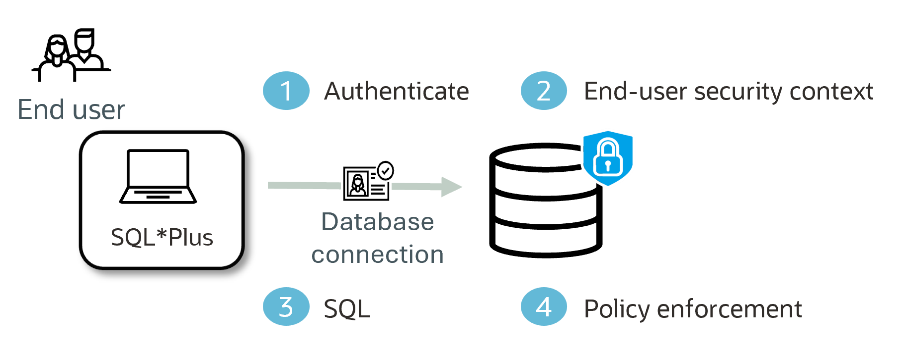

# Using SQL Macros to Simplify Deep Data Security Data Grants

## What You Will Learn

Welcome to this **Oracle Deep Data Security FastLab**.

This FastLab builds on the **Getting Started with Oracle Deep Data Security** lab and shows how SQL macros can simplify the administration of data grant predicates. You will keep the same HR scenario and the same effective access for Emma and Marvin, but define the predicate logic once in reusable SQL macros.

In this lab, you will:

- Create table-bound scalar SQL macros for employee and manager predicates.
- Replace inline data grant predicates with macro invocations.
- Create a parameterized SQL macro.
- Verify that the macro-based grants preserve the original row and column access behavior.
- Review the privileges and lifecycle considerations that apply when data grants reference SQL macros.

Estimated Time: 15 minutes

## The Scenario

The foundational lab protects `hr.employees` with two data grants:

- `HRAPP_EMPLOYEE_ACCESS` allows an employee to see and update permitted columns in their own row.
- `HRAPP_MANAGER_ACCESS` allows a manager to see their direct reports, with more limited column access.

The original grants contain the predicate logic directly in each `WHERE` clause. As an application grows, the same predicate may be needed by multiple grants. SQL macros allow you to define that logic once and reference it wherever it is needed.

The objective of this lab is not to change the authorization model. Emma should still see one row, and Marvin should still see himself and his three direct reports. Only the way the predicates are defined will change.



## How SQL Macros Work in Data Grants

A scalar SQL macro returns SQL text that can be expanded by the SQL engine. In a data grant `WHERE` clause, the macro must evaluate to a Boolean predicate.

Data grant predicates support simplified scalar SQL macros. Table-valued and dynamic SQL macros are not supported.

A macro can be:

- **Table-bound**, using an `ON` clause to bind unqualified column references to a specific table.
- **Parameterized**, allowing one macro definition to be used with different values.
- **Schema-qualified**, which is the recommended form when referencing it from a data grant.

Always include parentheses when invoking a macro, even when it has no parameters. For example:

```sql
hr.employee_matches_context()
```

Without parentheses, the database may interpret the macro name as a column reference.

## Prerequisites

Before starting this FastLab, complete the foundational **Getting Started with Oracle Deep Data Security** lab through the point where these objects exist:

- `hr.employees` and `hr.managers` tables
- End users `EMMA` and `MARVIN`
- Data roles `HRAPP_EMPLOYEES` and `HRAPP_MANAGERS`
- Data grants `HRAPP_EMPLOYEE_ACCESS` and `HRAPP_MANAGER_ACCESS`

You also need:

- An **Oracle AI Database 26ai** instance
- A DBA account or the `DEEPSEC_ADMIN` account from the foundational lab
- Permission to create SQL macros and administer data grants
- The account that creates the macros must be authorized to create them in the `HR` schema. Confirm this separately if you use the least-privilege administrator from the foundational lab.

The examples in this FastLab use the same HR data as the foundational lab. Run administrative tasks as your Deep Data Security administrator unless otherwise noted.

## Task 0: Verify the Baseline Data Grants

Before changing the grants, inspect the existing predicates. This gives you a baseline for comparison after the macros are introduced.

```sql
<copy>
SELECT DISTINCT grant_name,
                privilege,
                predicate
  FROM dba_data_grants
 WHERE object_owner = 'HR'
   AND object_name = 'EMPLOYEES'
 ORDER BY grant_name, privilege;
</copy>
```

You should see predicates similar to these:

| GRANT_NAME | PREDICATE |
|---|---|
| `HRAPP_EMPLOYEE_ACCESS` | `upper(user_name) = upper(ORA_END_USER_CONTEXT.username)` |
| `HRAPP_MANAGER_ACCESS` | `manager_id IN (SELECT ... FROM hr.managers ...)` |

The exact formatting of the predicate returned by `DBA_DATA_GRANTS` can vary. The important point is that both grants currently contain their predicate logic inline.

## Task 1: Create Table-Bound SQL Macros

Create one macro for the employee predicate and one for the manager predicate.

### 1. Create the employee macro

This macro returns `TRUE` when the row belongs to the authenticated end user.

```sql
<copy>
CREATE OR REPLACE MACRO hr.employee_matches_context
  ON hr.employees AS (
    upper(user_name) = upper(ORA_END_USER_CONTEXT.username)
  );
</copy>
```

The `ON hr.employees` clause binds the unqualified `user_name` column to `hr.employees`. This macro can be referenced only by data grants whose target object is `hr.employees`.

### 2. Create the manager macro

This macro finds rows belonging to employees who report to the authenticated end user.

```sql
<copy>
CREATE OR REPLACE MACRO hr.manager_reports_context
  ON hr.employees AS (
    manager_id IN (
      SELECT m.manager_id
        FROM hr.managers m
       WHERE upper(m.mgr_user_name) =
             upper(ORA_END_USER_CONTEXT.username)
    )
  );
</copy>
```

The macro uses the `manager_id` column from `hr.employees` and the manager lookup table from the foundational lab.

### 3. Verify the macros

```sql
<copy>
SELECT owner,
       object_name,
       status
  FROM dba_objects
 WHERE owner = 'HR'
   AND object_name IN ('EMPLOYEE_MATCHES_CONTEXT',
                       'MANAGER_REPORTS_CONTEXT')
 ORDER BY object_name;
</copy>
```

Both macros should exist and be valid.

### Privilege note

The owner of a data grant must have the `EXECUTE` privilege on every SQL macro referenced by its predicate, as well as the required privileges on objects referenced by the macro.

In this lab, the macros and data grants use the `HR` schema, so the data grant owner is also the macro owner. If you place the macros in a separate security schema, grant `EXECUTE` on each macro to the data grant owner. For example:

```sql
<copy>
GRANT EXECUTE ON security.employee_matches_context
  TO hr;

GRANT EXECUTE ON security.manager_reports_context
  TO hr;
</copy>
```

## Task 2: Replace Inline Predicates with Macro Invocations

> **Connection:** Run this task as your Deep Data Security administrator.

Replace the two existing data grants. The column privileges and grantees remain unchanged; only the predicate implementation changes.

### 1. Replace the employee data grant

```sql
<copy>
CREATE OR REPLACE DATA GRANT hr.HRAPP_EMPLOYEE_ACCESS
  AS SELECT, UPDATE(phone_number, first_name)
  ON hr.employees
  WHERE hr.employee_matches_context()
  TO HRAPP_EMPLOYEES;
</copy>
```

### 2. Replace the manager data grant

```sql
<copy>
CREATE OR REPLACE DATA GRANT hr.HRAPP_MANAGER_ACCESS
  AS SELECT (ALL COLUMNS EXCEPT ssn),
            UPDATE (salary, department_id, first_name)
  ON hr.employees
  WHERE hr.manager_reports_context()
  TO HRAPP_MANAGERS;
</copy>
```

The database validates that each referenced macro exists. Because both macros have an `ON hr.employees` clause, the bound object also matches the data grant target object.

### 3. Inspect the updated data grants

```sql
<copy>
SELECT DISTINCT grant_name,
                predicate
  FROM dba_data_grants
 WHERE object_owner = 'HR'
   AND object_name = 'EMPLOYEES'
 ORDER BY grant_name;
</copy>
```

The data grant definitions should now reference the SQL macro invocations:

```sql
hr.employee_matches_context()
hr.manager_reports_context()
```

The macro definitions hold the reusable predicate logic, while the data grants continue to hold the column privileges and grantee assignments.

## Task 3: Verify Emma's Access

Connect as Emma using the same connection method as the foundational lab.

```sql
<copy>
sqlplus emma/Oracle123@hrdb
</copy>
```

### 1. Confirm the end-user identity

```sql
<copy>
SELECT ORA_END_USER_CONTEXT.username
  FROM dual;
</copy>
```

The result should identify Emma.

### 2. Query the employees table

```sql
<copy>
SELECT employee_id,
       first_name,
       last_name,
       ssn,
       salary
  FROM hr.employees
 ORDER BY employee_id;
</copy>
```

Emma should still see only her own row, including her own SSN and salary.

| EMPLOYEE_ID | FIRST_NAME | LAST_NAME | SSN | SALARY |
|---:|---|---|---|---:|
| 3 | Emma | Baker | 333-33-3333 | 120000 |

### 3. Confirm row filtering

```sql
<copy>
SELECT COUNT(*) AS visible_rows
  FROM hr.employees;
</copy>
```

Expected result:

```text
VISIBLE_ROWS
------------
1
```

The SQL macro expanded to the same predicate that was previously written directly in the data grant. Emma's effective access has not changed.

## Task 4: Verify Marvin's Access

Connect as Marvin.

```sql
<copy>
sqlplus marvin/Oracle123@hrdb
</copy>
```

### 1. Query the employees table

```sql
<copy>
SELECT employee_id,
       first_name,
       last_name,
       ssn,
       salary
  FROM hr.employees
 ORDER BY employee_id;
</copy>
```

Marvin should still see four rows: his own row and the rows for Emma, Charlie, and Dana. The manager grant excludes SSNs for his direct reports, while the employee grant allows Marvin to see his own SSN.

| EMPLOYEE_ID | FIRST_NAME | LAST_NAME | SSN | SALARY |
|---:|---|---|---|---:|
| 2 | Marvin | Morgan | 222-22-2222 | 175000 |
| 3 | Emma | Baker | *NULL* | 120000 |
| 4 | Charlie | Davis | *NULL* | 95000 |
| 5 | Dana | Lee | *NULL* | 130000 |

### 2. Confirm row filtering

```sql
<copy>
SELECT COUNT(*) AS visible_rows
  FROM hr.employees;
</copy>
```

Expected result:

```text
VISIBLE_ROWS
------------
4
```

### 3. Confirm column-level enforcement

Marvin can update salary for his direct reports because the manager data grant includes `UPDATE(salary)`. The macro changes the row predicate only; it does not change the column privileges.

```sql
<copy>
UPDATE hr.employees
   SET salary = salary * 1.05
 WHERE first_name = 'Emma';

ROLLBACK;
</copy>
```

The update should affect one row and the rollback should restore the original salary.

Marvin still cannot update Emma's phone number through the manager grant:

```sql
<copy>
UPDATE hr.employees
   SET phone_number = '555-444-4444'
 WHERE first_name = 'Emma';
</copy>
```

The update should affect zero rows because no applicable data grant authorizes Marvin to update that column for Emma's row.

## Task 5: Create a Parameterized SQL Macro

> **Connection:** Reconnect as your Deep Data Security administrator before starting this task. The macro, data role, and data grant statements in this task should not be run as Marvin.

Parameterized macros allow one definition to be reused with different predicate values. Create a department filter that is bound to `hr.employees`.

```sql
<copy>
CREATE OR REPLACE MACRO hr.department_filter(
  p_department_id NUMBER
)
  ON hr.employees AS (
    department_id = p_department_id
  );
</copy>
```

The macro can now be called with different department values:

```sql
hr.department_filter(1)
hr.department_filter(2)
hr.department_filter(3)
```

For example, an additional data grant could use it to provide department-specific access:

```sql
<copy>
CREATE DATA ROLE HRAPP_DEPARTMENT_AUDIT;

CREATE OR REPLACE DATA GRANT hr.HRAPP_DEPARTMENT_AUDIT_ACCESS
  AS SELECT
  ON hr.employees
  WHERE hr.department_filter(2)
  TO HRAPP_DEPARTMENT_AUDIT;
</copy>
```

This grant allows the role to select rows where `department_id = 2`. It uses the same macro definition that could be reused for other department-specific grants with a different parameter value.

If you want to observe the grant in the lab, grant the data role to Marvin and query the table:

```sql
<copy>
GRANT DATA ROLE HRAPP_DEPARTMENT_AUDIT TO marvin;
</copy>
```

Reconnect as Marvin and query `hr.employees`. Marvin will see Bob's department 2 row in addition to the rows already available through his employee and manager grants. Reconnect as the administrator and remove the temporary role assignment when finished:

```sql
<copy>
REVOKE DATA ROLE HRAPP_DEPARTMENT_AUDIT FROM marvin;
</copy>
```

If this role and grant were created only for this demonstration, you can remove them after revoking the role:

```sql
<copy>
DROP DATA ROLE HRAPP_DEPARTMENT_AUDIT;
</copy>
```

The parameterized macro can remain in the database for future data grants. Do not drop a macro while active data grants depend on it.

## Validation and Runtime Behavior

When a data grant is created or replaced, the database validates that:

- The referenced macro exists.
- The macro invocation is valid.
- A table-bound macro's `ON` object matches the data grant target object.
- The data grant owner has the required `EXECUTE` privilege on the macro.

At query time, the data grant layer passes the macro invocation to the SQL macro layer. The SQL macro layer expands the latest macro definition and performs binding validation.

This means that changing a macro can change the behavior of every dependent data grant. Do not drop a referenced macro or make an incompatible change to its parameter signature or `ON` binding while active data grants depend on it.

If a referenced macro is missing, incompatible, or invalid, dependent data access can fail at runtime with:

```text
ORA-52561: Invalid predicate in data grant
```

Treat SQL macros used by data grants as part of the authorization configuration. Version and test them with the same care as the data grants themselves.

## What You Learned

In this FastLab, you:

- Created table-bound scalar SQL macros.
- Replaced duplicated inline predicates with reusable macro calls.
- Created a parameterized macro for department-based filtering.
- Verified that macro-based predicates preserve row-level and column-level data grant behavior.
- Reviewed the privilege, binding, and runtime dependency rules for SQL macros.

The important result is that the authorization behavior did not change. SQL macros moved the predicate logic into reusable definitions, making future data grant administration simpler and more consistent.

## Next Steps

Continue with the following Deep Data Security topics:

- Use `ORA_IS_COLUMN_AUTHORIZED` to distinguish an unauthorized `NULL` from a genuine `NULL` value.
- Use `ORA_CHECK_DATA_PRIVILEGE` to determine whether a user can perform a specific row or column operation.
- Review data grant behavior when users, roles, tables, views, or columns are dropped or changed.
