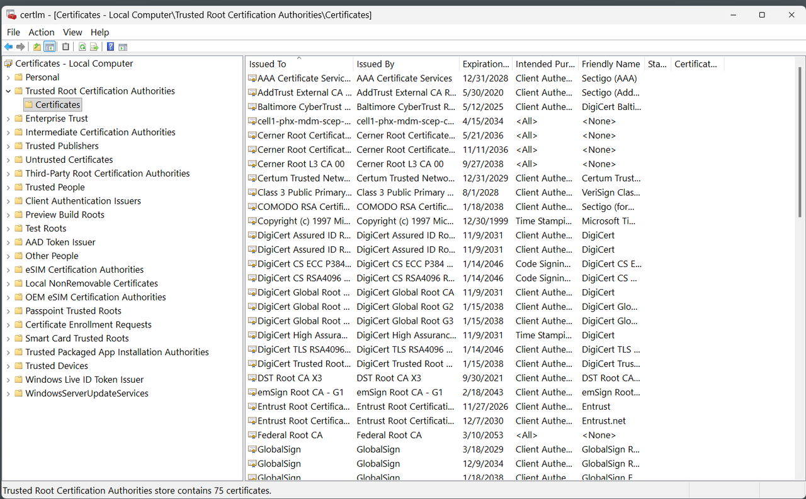

# How Do You Configure TLS 1.2 and TLS 1.3 with Hybrid Post-Quantum Key Exchange?

## Introduction

Configure TLS 1.2 and TLS 1.3 on Oracle AI Database 19.32 or Oracle AI Database 26ai. Prefer hybrid key exchange for TLS 1.3 when the selected release, provider, and both endpoints support it. Verify both versions over TCPS and separate key establishment from the record cipher.

Estimated Time: 15 minutes

Before running any script, confirm that this is a disposable, non-production system.

The scripts require the exact acknowledgement `NON_PROD_TLS_ACCEPTANCE=YES`. Type the acknowledgement manually; this lab intentionally does not provide a Copy button for it.

```bash
export NON_PROD_TLS_ACCEPTANCE=YES
```

For a persistent setting, type these lines manually to add it to `.bashrc` and reload the shell:

```bash
echo 'export NON_PROD_TLS_ACCEPTANCE=YES' >> ~/.bashrc
source ~/.bashrc
```

For the current shell only, type:

```bash
export NON_PROD_TLS_ACCEPTANCE=YES
```

Before you begin, set `PDB_NAME` in the shell used for this lab. The scripts use it for the database service and generated TNS aliases. If it is not set, the scripts default to `pdb1`.

For a persistent setting, add it to `.bashrc` and reload the shell:

```bash
<copy>
echo 'export PDB_NAME=pdb1' >> ~/.bashrc
source ~/.bashrc
</copy>
```

For the current shell only, run:

```bash
<copy>
export PDB_NAME=pdb1
</copy>
```

### Objectives

In this lab, you will:

- Create a lab-only root CA and a database server key pair and certificate.
- Configure `TLS_VERSION` to permit both TLS 1.2 and TLS 1.3.
- Configure `TLS_KEY_EXCHANGE_GROUPS` with hybrid key exchange preferred.
- Test TLS 1.3 and TLS 1.2 connections through the same TCPS endpoint.
- Verify the network protocol, negotiated TLS version, and cipher suite with `SYS_CONTEXT`.

### Prerequisites

This lab assumes you have:

- An Oracle AI Database 19.32 or Oracle AI Database 26ai server and a matching client with TLS 1.3 support.
- OS access to the database host and client configuration files as the appropriate Oracle software owner.
- `sudo` access to install the lab root CA in the Oracle Linux trust store.
- Database credentials for the lab PDB.

## Task 1: Download and prepare the TLS scripts

Open a Terminal session on your **DBSec-Lab** VM as OS user `oracle`. The archive contains only the `tls/` directory and its scripts.

1. Create the `livelabs` directory and move into it.

    ```bash
    <copy>
    mkdir -pv livelabs
    cd livelabs
    </copy>
    ```

    If you are using a remote desktop session, double-click the **Terminal** icon on the desktop.

2. Download the bundled TLS scripts.

    ```bash
    <copy>
    wget -v -O tls.zip https://objectstorage.us-ashburn-1.oraclecloud.com/p/BHNwcP7_8g6cj9ap6j8r3rjBky44eNnrTsm8SGQ4jijQWWzjb4pMAnuiXxS1KQ8q/n/oradbclouducm/b/dbsec_public/o/tls.zip
    </copy>
    ```

3. Extract the archive and remove the downloaded ZIP.

    ```bash
    <copy>
    unzip tls.zip
    rm -vf tls.zip
    </copy>
    ```

4. Enter the extracted `tls` directory and prepare the scripts.

    ```bash
    <copy>
    cd tls
    chmod -v +x -- *.sh
    if command -v dos2unix >/dev/null 2>&1; then dos2unix -v -- *; else echo "dos2unix is not installed; the bundled scripts already use Unix line endings."; fi
    </copy>
    ```

## Task 2: Configure TLS 1.2 and TLS 1.3 on the host

Run these scripts from the extracted `livelabs/tls` directory on the database host as the Oracle software owner. The scripts create a lab-only root CA, create a database server key pair and certificate signing request (CSR), sign the server certificate with the lab CA, and deploy the resulting wallet. They then back up the Oracle Net files, configure TLS 1.2 and TLS 1.3, create a TCPS alias named `${PDB_NAME}_tls`, and add or update the TCPS listener endpoint. They use the Oracle-recommended TCPS port `2484` when adding a new endpoint and reuse an existing TCPS listener port when one is already configured.

This lab uses a self-signed root CA for a disposable, non-production environment. The database key pair itself is neither signed nor unsigned. The CSR produced from its public key is signed by the lab CA to create the database server certificate.

By default, wallet deployment sets `WALLET_ROOT`, restarts the database, deploys the same server wallet to both the CDB-root and PDB-specific TLS directories under `WALLET_ROOT`, uses the CDB-root copy for the listener, and deploys an Oracle client wallet to `${TNS_ADMIN}/wallet`. The host setup then restarts the listener so the new TCPS endpoint and wallet settings take effect. Task 3 configures Oracle Instant Client 26ai to use the Oracle Linux system trust store instead of a client wallet.

1. **Version-specific provider note:** On Oracle Database 19.32, TLS 1.3, ML-KEM, and hybrid key exchange require the next-generation cryptographic provider. The legacy provider remains the default on 19.32 and supports TLS only through 1.2, so it cannot use TLS 1.3 settings or `TLS_KEY_EXCHANGE_GROUPS` values that depend on TLS 1.3. Before configuring TLS, switch providers and restart. See the [Oracle Database 19c documentation on switching cryptographic providers](https://docs.oracle.com/en/database/oracle/oracle-database/19/dbseg/switching-crypto-providers.html):

    ```bash
    <copy>
    python $ORACLE_HOME/bin/set_crypto_provider.py next-generation
    </copy>
    ```

    Restart the database instance and reload the listener after the switch. Confirm the provider is active before continuing:

    ```bash
    <copy>
    python $ORACLE_HOME/bin/set_crypto_provider.py status
    </copy>
    ```

2. Confirm the variables and Oracle Net locations.

    ```bash
    <copy>
    echo "PDB_NAME=$PDB_NAME"
    echo "ORACLE_HOME=$ORACLE_HOME"
    echo "TNS_ADMIN=${TNS_ADMIN:-$ORACLE_HOME/network/admin}"
    </copy>
    ```

    If `/etc/oratab` contains multiple database entries for the same `ORACLE_HOME`, set both `ORACLE_HOME` and `ORACLE_SID` explicitly. The scripts stop rather than guess which database to change.

3. Create the lab root CA and database server identity wallet. The script prompts for the TLS wallet password twice and stops without changing a wallet if the entries do not match.

    ```bash
    <copy>
    ./tls_create_server_identity.sh
    </copy>
    ```

    If an earlier run created a root certificate that is not marked as a CA certificate, rebuild the generated identity. The script preserves timestamped backups of both generated wallet directories before replacing them:

    ```bash
    <copy>
    ./tls_create_server_identity.sh --recreate
    </copy>
    ```

    After rebuilding the identity, continue with the deployment command in the next step so the corrected certificate chain replaces the previously deployed wallet.

    If the earlier root certificate was already installed in the Oracle Linux trust store, use the `--replace` option in step 5.

4. Deploy the database wallet. By default, this command sets `WALLET_ROOT` and restarts the database before copying the wallet files.

    ```bash
    <copy>
    ./tls_deploy_db_wallet.sh
    </copy>
    ```

5. Install the generated lab root CA certificate in the Oracle Linux trust store.

    ```bash
    <copy>
    ./tls_install_linux_cert.sh
    </copy>
    ```

    A normal installation refuses to overwrite a different certificate at the lab trust-anchor path. If you rebuilt the identity with `--recreate`, review the existing anchor, and then replace it explicitly:

    ```bash
    <copy>
    ./tls_install_linux_cert.sh --replace
    </copy>
    ```

6. Configure TLS 1.2 and TLS 1.3. Hybrid key exchange remains disabled until Task 4.

    ```bash
    <copy>
    export TLS_CONFIGURE_TLS13=YES
    export TLS_CONFIGURE_HYBRID=NO
    ./tls_setup_host.sh
    </copy>
    ```

7. Configure the `oracle` user client with the deployed wallet.

    ```bash
    <copy>
    ./tls_setup_client.sh
    </copy>
    ```

8. Confirm the host configuration and generated alias.

    ```bash
    <copy>
    ./tls_verify_host.sh
    </copy>
    ```

### Inspect the TLS connection as `oracle`

Connect through the `${PDB_NAME}_tls` alias and record the protocol, negotiated TLS version, and record-layer cipher suite.

1. Connect with the generated TCPS alias as the `system` user and enter its password when prompted.

    ```bash
    <copy>
    sqlplus "system@${PDB_NAME}_tls"
    </copy>
    ```

2. Verify the connection values.

    ```sql
    <copy>
    SELECT SYS_CONTEXT('USERENV', 'NETWORK_PROTOCOL') AS network_protocol,
           SYS_CONTEXT('USERENV', 'TLS_VERSION') AS tls_version,
           SYS_CONTEXT('USERENV', 'TLS_CIPHERSUITE') AS tls_ciphersuite
      FROM dual;
    </copy>
    ```

    `NETWORK_PROTOCOL` should be `tcps`.

3. Exit SQL*Plus to return to the command line before continuing to the next task.

    ```sql
    <copy>
    exit
    </copy>
    ```

## Task 3: Create and test the Lisa client

Create Lisa's client environment as `oracle`, and then switch to the Lisa operating-system account to run the connection tests. Lisa's scripts are installed in `/home/lisa/livelabs/tls`. Her walletless Oracle Net configuration is installed separately in `/home/lisa/tns_admin`. The client uses the Oracle Linux system certificate store populated in Task 2; Lisa does not receive a client wallet or private key. This follows Oracle guidance for [one-way TLS connections that use the Linux system certificate store](https://docs.oracle.com/en/database/oracle/oracle-database/26/dbseg/configuring-transport-layer-security-encryption.html).

1. From the `oracle` login shell in the extracted `livelabs/tls` directory, prepare Lisa's account, Instant Client, scripts, and Oracle Net configuration.

    ```bash
    <copy>
    ./tls_run_lisa.sh setup "$PDB_NAME"
    </copy>
    ```

    The setup validates the host and base TCPS alias, installs the [Oracle-recommended 26ai Instant Client](https://www.oracle.com/database/technologies/instant-client.html), creates or validates Lisa's account, and preserves backups before updating either Lisa directory.

2. Switch to Lisa's login shell.

    ```bash
    <copy>
    sudo -iu lisa
    </copy>
    ```

3. Confirm Lisa's home, scripts, and Oracle Net configuration.

    ```bash
    <copy>
    whoami
    pwd
    ls -l ~/livelabs/tls
    ls -l ~/tns_admin
    </copy>
    ```

    `whoami` should return `lisa`, and `pwd` should return `/home/lisa`. The TLS directory contains `tls_test_lisa.sh`, `tls_test_lisa.sql`, and the configured PDB name. The `tns_admin` directory contains `sqlnet.ora` and `tnsnames.ora`.

4. Change to Lisa's TLS directory and run both connection tests. Enter the `system` database password when SQL*Plus prompts for each connection.

    ```bash
    <copy>
    cd ~/livelabs/tls
    ./tls_test_lisa.sh
    </copy>
    ```

    The test selects the RPM-owned SQL*Plus binary and uses `~/tns_admin` to connect through the dedicated TLS 1.2 and TLS 1.3 aliases. It verifies both `NETWORK_PROTOCOL` and the negotiated `TLS_VERSION`.

5. Confirm that both tests report `PASS`.

    ```text
    <copy>
    PASS: pdb1_tls12 negotiated tcps / TLS 1.2.
    PASS: pdb1_tls13 negotiated tcps / TLS 1.3.
    </copy>
    ```

    The alias prefix follows the PDB name recorded during setup, so the displayed alias changes when you configure a different PDB.

6. When testing is complete, return to the `oracle` shell.

    ```bash
    <copy>
    exit
    </copy>
    ```

### Optional: Use a Windows client

Lisa’s Oracle Linux client trusts the lab root CA through the host-wide Linux certificate store. A Windows client can use the same walletless one-way TLS model through the Microsoft Certificate Store, which Oracle Database clients support as a system certificate store. See [Oracle client configuration guidance for one-way TLS](https://docs.oracle.com/en/database/oracle/oracle-database/26/dbseg/configuring-transport-layer-security-encryption.html).

Copy only the lab public root CA certificate, `certificates/rootCA/rootCA.crt`, from the database host to the Windows client. Do not copy the database server private key or wallet.

1. Press **Win+R**, enter `certlm.msc`, and approve elevation.

2. Expand **Trusted Root Certification Authorities**, and then select **Certificates**. The screenshot shows the Local Computer store where Windows makes trusted roots available across Windows accounts.

    

3. Right-click **Certificates**, select **All Tasks**, and then select **Import**.

4. Select `rootCA.crt` and finish the Certificate Import Wizard. Import only the public root CA certificate; do not import a server private key or wallet.

In the Windows `tnsnames.ora`, retain `(WALLET_LOCATION=SYSTEM)` in the `SECURITY` section of each TCPS alias. This explicitly tells SQL*Plus to validate the database server certificate with the Windows system certificate store. Keep server hostname matching enabled, and ensure that the alias `HOST` value matches the server certificate.

With Windows Instant Client 26ai and those aliases configured, connect using the database username and password. This one-way TLS configuration does not require a client wallet.

Database authentication still uses `system` and its database password. Lisa is the Linux client identity, not a database account. Use a least-privileged database account instead of `system` outside this disposable lab.

## Task 4: Prefer hybrid key exchange

`TLS_KEY_EXCHANGE_GROUPS` controls key-establishment groups. The `hybrid` group combines ML-KEM and ECDHE into one shared secret. It changes key establishment, not the record cipher shown by `TLS_CIPHERSUITE`.

1. Enable hybrid key exchange on the database host. The scripts update the server and listener configuration and retain the backups created in Task 2.

    ```bash
    <copy>
    export TLS_CONFIGURE_HYBRID=YES
    ./tls_setup_host.sh
    </copy>
    ```

2. Configure both Oracle Net clients to prefer hybrid. Lisa's client files remain under `/home/lisa/tns_admin` and continue using the OS trust store.

    ```bash
    <copy>
    ./tls_setup_client.sh
    TLS_CLIENT_USE_SYSTEM_TRUST=YES TLS_CLIENT_USER=lisa TLS_CLIENT_TNS_ADMIN=/home/lisa/tns_admin ./tls_setup_client.sh
    </copy>
    ```

    `hybrid` is listed first so endpoints that support hybrid PQC prefer it. `ec` provides a classical ECDHE fallback for a TLS 1.3 client that cannot negotiate hybrid. ML-KEM and hybrid key exchange apply only to TLS 1.3.

3. Confirm the effective configuration entries.

    ```bash
    <copy>
    grep -Ei '^[[:space:]]*(TLS_VERSION|TLS_KEY_EXCHANGE_GROUPS)[[:space:]]*=' \
      "${TNS_ADMIN:-$ORACLE_HOME/network/admin}/sqlnet.ora" \
      "${TNS_ADMIN:-$ORACLE_HOME/network/admin}/listener.ora"
    </copy>
    ```

    The SQL context does not expose the negotiated group; the `TLS_CIPHERSUITE` value is not proof of hybrid key exchange.

## Task 5: Test TLS 1.3 and TLS 1.2

Use the provided script to create connection-specific aliases and prove that the endpoint accepts both versions. Do not copy or edit TNS entries by hand.

1. Create the version-specific aliases.

    ```bash
    <copy>
    ./tls_setup_test_aliases.sh
    </copy>
    ```

    The script reads the TCPS host, port, and service from `${PDB_NAME}_tls`, then creates `${PDB_NAME}_tls13` and `${PDB_NAME}_tls12` with connection-specific TLS versions. It backs up `tnsnames.ora` before editing it. If both version aliases already exist, it leaves them unchanged; if only one exists, review the file before continuing.

2. Connect through the TLS 1.3 alias and verify the session.

    ```bash
    <copy>
    sqlplus "system@${PDB_NAME}_tls13"
    </copy>
    ```

    ```sql
    <copy>
    SELECT SYS_CONTEXT('USERENV', 'NETWORK_PROTOCOL') AS network_protocol,
           SYS_CONTEXT('USERENV', 'TLS_VERSION') AS tls_version,
           SYS_CONTEXT('USERENV', 'TLS_CIPHERSUITE') AS tls_ciphersuite
      FROM dual;
    </copy>
    ```

    The result should show `tcps` and `TLS 1.3`. On 26ai, or on 19.32 after switching to the next-generation provider, Task 4 makes `hybrid` the preferred TLS 1.3 key-exchange group when both endpoints support it.

3. Exit SQL*Plus to return to the command line.

    ```sql
    <copy>
    exit
    </copy>
    ```

4. Connect through the TLS 1.2 alias, and run the same query.

    ```bash
    <copy>
    sqlplus "system@${PDB_NAME}_tls12"
    </copy>
    ```

    The result should show `tcps` and `TLS 1.2`. The TLS 1.2 connection demonstrates backward compatibility; it does not use ML-KEM or hybrid key exchange.

### Interpret the results

1. Compare the `${PDB_NAME}_tls13` and `${PDB_NAME}_tls12` query results.

2. Read the individual values as follows.

    - `NETWORK_PROTOCOL=tcps` confirms that the database session uses Transport Layer Security.
    - `TLS_VERSION` confirms which protocol version the endpoints negotiated.
    - `TLS_CIPHERSUITE` identifies the record-layer authentication, encryption, and integrity algorithms. It does not identify the key-exchange group.

For either supported release, `hybrid` is the configured TLS 1.3 preference when the selected provider and both endpoints support it. On 19.32, this requires the next-generation provider.
The SQL context does not expose the negotiated group; the cipher output is not proof of hybrid key exchange.


If TLS 1.3 fails, confirm the selected release and provider, then confirm hybrid support on both endpoints. On 19.32, confirm that the next-generation provider is active. Reload the listener and check that the client uses the intended `TNS_ADMIN` files. If needed, restore the Task 2 backups and reload the listener.

### Optional rollback

Use `tls_restore.sh` to restore the original Oracle Net files saved before the lab. The script backs up the current files first, requires the non-production acknowledgement and explicit rollback confirmation, restarts the listener, and re-registers database services. It does not change wallets or certificates; wallet-directory backups are retained.

    ```bash
    <copy>
    ./tls_restore.sh --yes-i-understand
    </copy>
    ```

The default `original` selector restores the `.before-tls-fastlab` backups. To restore a timestamped backup instead, set `TLS_RESTORE_BACKUP` to the timestamp suffix.

The restore script does not remove Lisa or uninstall Oracle Instant Client. If you want to remove either one, run the corresponding cleanup script independently. Each script requires the non-production acknowledgement and explicit destructive confirmation.

To remove the `lisa` operating-system account and `/home/lisa`, first exit all Lisa sessions, and then run:

    ```bash
    <copy>
    ./tls_remove_lisa.sh --yes-i-understand
    </copy>
    ```

To remove the Oracle Instant Client Basic, SQL*Plus, and 26ai release RPMs installed by this lab, run:

    ```bash
    <copy>
    ./tls_remove_ora_client.sh --yes-i-understand
    </copy>
    ```

The package cleanup disables dependency autoremove and does not request removal of other Instant Client packages. Do not run it if another application uses these RPMs.

To remove the lab root certificate from the Oracle Linux trust store without changing Oracle Net files, run:

    ```bash
    <copy>
    ./tls_remove_linux_cert.sh --yes-i-understand
    </copy>
    ```

You may now proceed to the next lab.


## Signature Workshop

Ready to dive deeper? These workshops move from TLS setup to a complete encrypted database connection.

👉 [Successfully protect your database communication using 1-way Transport Layer Security (TLS)](https://livelabs.oracle.com/ords/r/dbpm/livelabs/view-workshop?wid=3631)

## Learn More

- [Oracle AI Database 26ai Security Guide: Transport Layer Security](https://docs.oracle.com/en/database/oracle/oracle-database/26/dbseg/configuring-transport-layer-security-encryption.html)
- [Oracle AI Database 26ai Net Services Reference: `sqlnet.ora` Parameters](https://docs.oracle.com/en/database/oracle/oracle-database/26/netrf/parameters-for-the-sqlnet.ora.html)
- [Oracle Database 19c Security Guide: Transport Layer Security](https://docs.oracle.com/en/database/oracle/oracle-database/19/dbseg/configuring-transport-layer-security-encryption.html)
- [Oracle Database 19c Net Services Reference: `sqlnet.ora` Parameters](https://docs.oracle.com/en/database/oracle/oracle-database/19/netrf/parameters-for-the-sqlnet.ora.html)
- [Oracle Database 19c Now Supports TLS 1.3, Post-Quantum Cryptography, and FIPS 140-3 Mode](https://blogs.oracle.com/database/database-19c-now-supports-tls-1-3-post-quantum-cryptography)
- [Both is better - Oracle AI Database 26ai adds hybrid-mode quantum-resistant support](https://blogs.oracle.com/database/hybrid-pqc)
- [Announcing support for TLS 1.3 in Oracle Database 23ai](https://blogs.oracle.com/database/announcing-tls13)
- [Oracle AI Database walletless TLS](https://www.braddiggs.com/2026/08/oracle-ai-database-walletless-tls.html) (community article)

## Acknowledgements

- **Author** - Richard C. Evans
- **Last Updated By/Date** - Richard C. Evans, September 2026
- **Technical references** - Oracle Database Security documentation and Oracle Database Insider articles listed above
