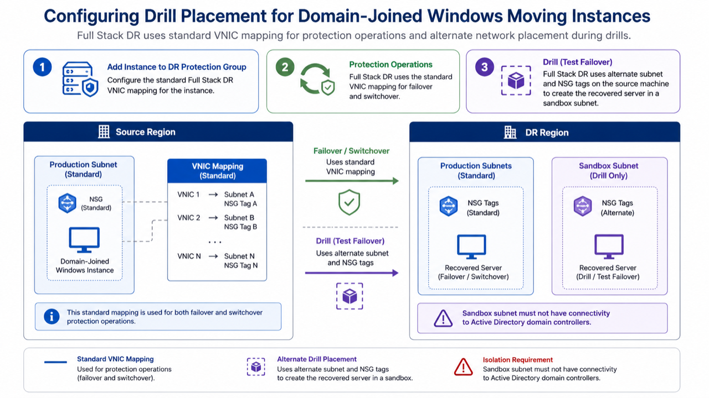
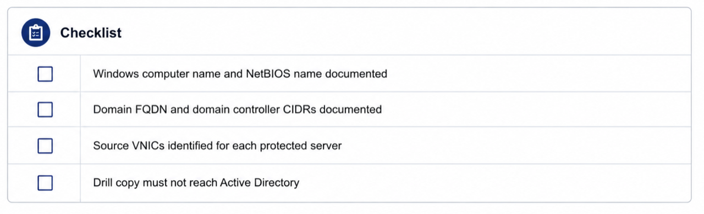
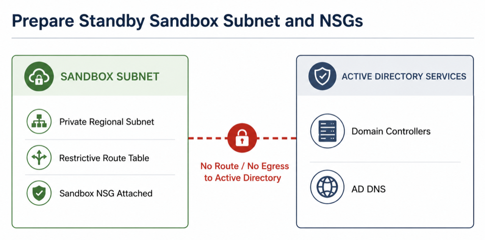
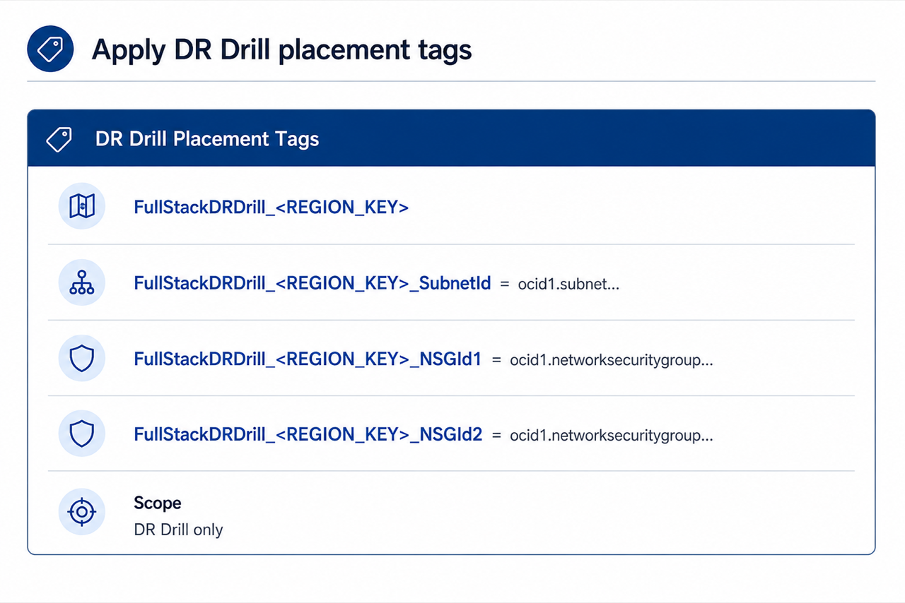
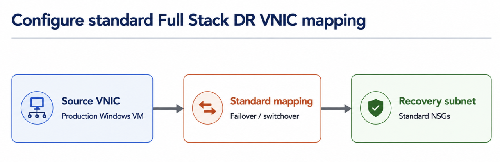
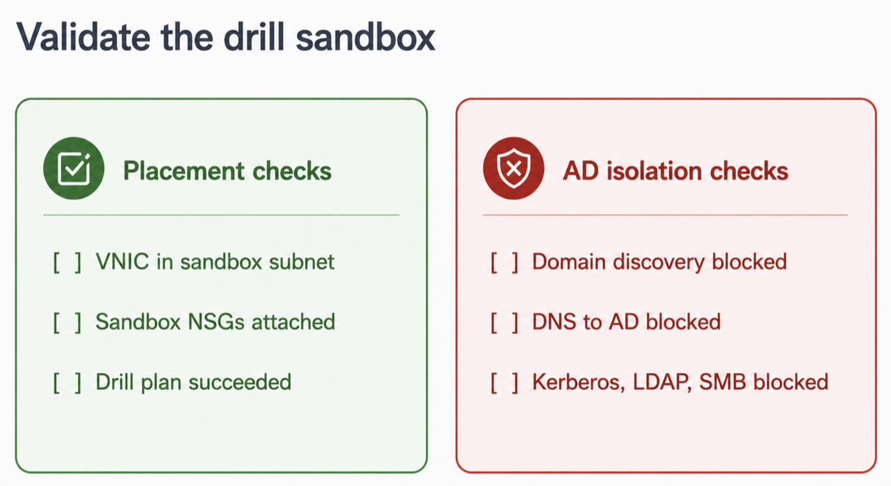

# How do I configure OCI Full Stack DR for Windows instances joined to Active Directory?

Duration: 60 minutes

## Introduction

Windows servers that belong to Active Directory need extra care during disaster recovery drills. A moving compute instance created by Oracle Cloud Infrastructure Full Stack Disaster Recovery (OCI Full Stack DR) can keep the same Windows computer name and NetBIOS identity as the production server. If the drill copy can reach the same domain controllers as production, Active Directory can see two machines with the same identity at the same time. That can break the machine account secure channel, create DNS or SPN conflicts, and make the drill unsafe.

This tutorial shows how to configure drill placement for domain-joined Windows moving instances. You still configure the standard Full Stack DR VNIC mapping when you add the instance to the DR protection group. Full Stack DR uses that standard VNIC mapping for failover and switchover. During a drill, Full Stack DR uses alternate subnet and NSG tags on the source machine to create the recovered server in a sandbox subnet. The sandbox subnet must not have connectivity to Active Directory domain controllers.


<br>**Figure 1:** FSDR moving-instance drill design for a Windows server joined to Active Directory.

> **Note:** Draft date: **May 28, 2026**. The alternate subnet and NSG tags in this tutorial apply only to **DR Drill** operations. Do not assume that these tags change switchover or failover placement.

## Objectives

By the end of this tutorial, you will be able to:

* Explain why Windows Active Directory joined instances need isolated drill networking.
* Prepare a standby sandbox subnet and NSGs that block access to Active Directory domain controllers.
* Apply DR Drill placement tags that identify the alternate subnet and NSGs for each drill target region.
* Configure the standard OCI Full Stack DR moving-instance VNIC mapping for failover and switchover.
* Run a drill and validate Active Directory isolation for the recovered Windows instance.

## Prerequisites

* Access to an OCI tenancy with permissions to manage:
    * OCI Full Stack DR protection groups and DR plans.
    * Compute instances, VNICs, subnets, route tables, security lists, and NSGs.
* Permissions to add tags to the source Windows compute instance.
* A pair of associated OCI Full Stack DR protection groups.
* A Windows compute instance joined to Active Directory and configured as a moving instance candidate.
* Block volume replication, volume group replication, or backup configuration that your Full Stack DR topology requires.
* A standby VCN in the standby region.
* The OCIDs for each region where a drill may create a recovered Windows instance:
    * Source Windows compute instance.
    * Source VNIC or VNICs.
    * Standard recovery subnet and NSGs for failover and switchover.
    * Alternate drill subnet.
    * Alternate drill NSG or NSGs.
* OCI CLI configured for the primary and standby regions if you use the optional validation commands.

For IAM guidance, see:

* [Policies for OCI Full Stack DR](https://docs.oracle.com/en-us/iaas/disaster-recovery/doc/disaster-recovery-policies.html)
* [Resource principal policy examples for OCI Full Stack DR](https://docs.oracle.com/en-us/iaas/disaster-recovery/doc/resource-principal.html)
* [Preparing compute instances for Full Stack Disaster Recovery](https://docs.oracle.com/en-us/iaas/disaster-recovery/doc/compute-instances-disaster-recovery.html)

## Task 1: Review the Active Directory Drill Risk

1. Identify each protected Windows server that belongs to Active Directory.

    Capture the Windows computer name, NetBIOS name, domain FQDN, source subnet, and source VNIC for each server.

2. Review what happens during a drill.

    In a moving-instance topology, Full Stack DR creates a recovered copy of the compute instance in the standby region for the drill. The operating system still has the production Windows identity unless you run custom scripts to change it.

3. Document the risk for each server.

    If the drill copy can reach Active Directory domain controllers, both the production machine and the drill copy can present the same computer identity. That can cause duplicate DNS records, Kerberos or secure-channel failures, or account lock behavior depending on domain policy.

4. Decide the drill isolation rule.

    For domain-joined Windows moving instances, use a standby subnet that does not route to domain controllers, DNS resolvers that forward to domain controllers, or on-premises AD networks.

    
    <br>**Figure:** Active Directory duplicate identity risk review.

## Task 2: Prepare the Standby Sandbox Subnet and NSGs

1. In the standby region, create or select a subnet dedicated to Windows AD-isolated drills.

    Recommended values:

    | Setting | Recommended value |
    | --- | --- |
    | Subnet type | Private regional subnet |
    | Route table | No route to DRG, LPG, RPC, VPN, FastConnect, or any path that reaches Active Directory |
    | DNS | OCI VCN resolver or an isolated resolver that does not forward to domain controllers |
    | Security list | Minimal ingress and egress; prefer NSGs for workload rules |
    | Purpose | Drill sandbox for domain-joined Windows moving instances |

2. Create an NSG for the recovered Windows drill instances.

    Use restrictive egress rules. Do not allow traffic to Active Directory domain controller CIDRs.

3. Block common Active Directory paths.

    At minimum, do not allow connectivity from the drill subnet or NSG to domain controllers on these ports:

    | Protocol | Ports | Active Directory use |
    | --- | --- | --- |
    | TCP/UDP | 53 | DNS |
    | TCP/UDP | 88 | Kerberos |
    | TCP/UDP | 389 | LDAP |
    | TCP | 445 | SMB |
    | TCP/UDP | 464 | Kerberos password change |
    | TCP | 636 | LDAPS |
    | TCP | 3268, 3269 | Global catalog |
    | TCP | 135 and dynamic RPC range | RPC endpoint mapper and AD-related RPC |

4. Keep a separate operator access path.

    Use OCI Bastion, a jump host in a controlled management subnet, or Run Command if you need to inspect the recovered drill instance. Do not solve operator access by reconnecting the sandbox subnet to Active Directory.

    
    <br>**Figure:** Standby sandbox subnet and NSG isolation design.

## Task 3: Apply DR Drill Placement Tags to the Source Windows Instance

Use tags on the source Windows compute instance to tell Full Stack DR which alternate subnet and NSGs to use during a DR Drill. Add one tag set for each region where a drill may create the recovered instance.

> **Important:** These alternate subnet and NSG tags apply only to **DR Drill** operations. Configure switchover and failover placement separately in the Full Stack DR moving-instance member settings and runbooks.

1. Identify the region key for each drill target region.

    Use the short region key in the tag name. For example, use `IAD` for Ashburn and `PHX` for Phoenix. For other regions, use the region key required by your tenancy and Full Stack DR convention.

2. Add the alternate subnet and NSG tags to the source Windows instance.

    Use this generic naming pattern:

    | Tag key | Value |
    | --- | --- |
    | `FullStackDRDrill_<REGION_KEY>_SubnetId` | OCID of the alternate drill subnet in that region |
    | `FullStackDRDrill_<REGION_KEY>_NSGId1` | OCID of the first alternate drill NSG in that region |
    | `FullStackDRDrill_<REGION_KEY>_NSGId2` | OCID of the second alternate drill NSG in that region |

    For an Ashburn and Phoenix DR pair, the source machine would use keys like these:

    | Tag key | Example value |
    | --- | --- |
    | `FullStackDRDrill_IAD_SubnetId` | `ocid1.subnet.oc1.iad.aaa` |
    | `FullStackDRDrill_IAD_NSGId1` | `ocid1.networksecuritygroup.oc1.iad.aaaa` |
    | `FullStackDRDrill_IAD_NSGId2` | `ocid1.networksecuritygroup.oc1.iad.bbbb` |
    | `FullStackDRDrill_PHX_SubnetId` | `ocid1.subnet.oc1.phx.aaaa` |
    | `FullStackDRDrill_PHX_NSGId1` | `ocid1.networksecuritygroup.oc1.phx.aaaa` |
    | `FullStackDRDrill_PHX_NSGId2` | `ocid1.networksecuritygroup.oc1.phx.bbbb` |

3. In the OCI Console, open the source Windows instance.

    Open the navigation menu, click **Compute**, then click **Instances**. Select the compartment that contains the source Windows instance, then click the instance name.

4. Open the tag editor.

    Click the **Tags** tab, then click **Add tags**. Depending on the Console layout, you may also find this action under **More actions**, then **Add tags**.

5. Add the DR Drill tags.

    If your tenancy uses free-form tags, choose **Free-form tag** and add each key/value pair. If your tenancy defines these tags under a tag namespace, choose the approved namespace and add the same keys and values as defined tags.

6. Save the tags.

    Click **Add tags** or **Save changes**.

7. Review the tag values before configuring the Full Stack DR member.

    The instance **Tags** tab should show one subnet tag and two NSG tags for each drill target region. The file [files/fsdr-ad-sandbox-tags-template.json](./files/fsdr-ad-sandbox-tags-template.json) contains a compact reference for the same tag names and placeholder values.

    
    <br>**Figure:** Region-specific DR Drill placement tag pattern for Windows Active Directory isolated drills.

## Task 4: Configure the Standard Full Stack DR VNIC Mapping

Configure the standard moving-instance VNIC mapping in the **primary** DR protection group. This step is required when you add the Windows instance to Full Stack DR. Full Stack DR uses this standard mapping for failover and switchover.

For a DR Drill, Full Stack DR reads the region-specific drill tags from the source Windows machine and uses the alternate subnet and NSGs for the target drill region. The drill tags do not replace the standard VNIC mapping.

1. In OCI Console, open **Migration & Disaster Recovery**, then **DR protection groups**.

2. Open the **primary** DR protection group.

3. Go to **Members**, then click **Manage members**.

4. Add or edit the Windows compute instance as a **moving instance**.

5. Configure the standard destination mapping for each VNIC.

    Use the normal recovery network design for failover and switchover:

    | Full Stack DR field | Value |
    | --- | --- |
    | Source VNIC | Source Windows instance VNIC |
    | Destination subnet | Standard recovery subnet for failover and switchover |
    | Destination network security groups | Standard recovery NSG or NSGs for failover and switchover |
    | Destination primary private IP address | Optional, based on your recovery design |
    | Destination hostname label | Optional, based on your recovery design |

6. Confirm the DR Drill alternate placement tags.

    The DR Drill alternate tags should resolve to these values for the drill target region:

    | Full Stack DR field | Value |
    | --- | --- |
    | Source VNIC | Source Windows instance VNIC |
    | Destination subnet | Alternate AD-isolated drill subnet from `FullStackDRDrill_<REGION_KEY>_SubnetId` |
    | Destination network security groups | Alternate drill NSGs from `FullStackDRDrill_<REGION_KEY>_NSGId1` and `FullStackDRDrill_<REGION_KEY>_NSGId2` |
    | Destination primary private IP address | Leave blank unless you need a specific isolated IP |
    | Destination hostname label | Leave blank for drills unless your isolation policy requires a different label |

7. Publish the DR protection group changes.

    
    <br>**Figure:** FSDR moving-instance VNIC mapping for an AD-isolated Windows drill.

8. For API, SDK, Terraform, or automation workflows, confirm that the standard mapping contains the failover and switchover subnet and NSG values.

    Example standard mapping shape:

    ```json
    {
      "sourceVnicId": "<source_vnic_ocid>",
      "destinationSubnetId": "<standard_recovery_subnet_ocid>",
      "destinationNsgIdList": [
        "<standard_recovery_nsg_ocid_1>",
        "<standard_recovery_nsg_ocid_2>"
      ]
    }
    ```

> **Note:** The official moving-instance VNIC mapping model uses a destination subnet and an optional destination NSG list. That model remains the source of truth for failover and switchover. The DR Drill tags provide alternate drill placement only.

> **Reminder:** Keep switchover and failover mappings aligned with your real recovery design. Use the alternate subnet and NSG tags only for sandbox drill placement.

## Task 5: Refresh, Verify, and Run a Drill

1. Open the **standby** DR protection group.

2. Refresh affected DR plans.

    Refresh any affected Start Drill, switchover, and failover plans. Run **Start drill** first to validate the sandbox behavior before you update operational runbooks.

3. Verify the refreshed plan.

4. Run prechecks.

5. Start the drill.

6. After Full Stack DR creates the recovered Windows instance, confirm the VNIC placement.

    ```bash
    oci compute instance list-vnics \
      --compartment-id <standby_compartment_ocid> \
      --instance-id <drill_instance_ocid>
    ```

    Confirm that the VNIC attaches to the standby sandbox subnet and uses the expected sandbox NSGs.

7. From the recovered Windows instance, validate that Active Directory is unreachable.

    You can use the sample PowerShell script in [files/windows-ad-isolation-validation.ps1](./files/windows-ad-isolation-validation.ps1).

    ```powershell
    .\windows-ad-isolation-validation.ps1 `
      -DomainFqdn "<ad_domain_fqdn>" `
      -DomainControllerIps "<domain_controller_ip_1>","<domain_controller_ip_2>"
    ```

    Expected result:

    * Domain controller discovery fails.
    * DNS queries for AD service records fail or return no domain controller records.
    * TCP tests to LDAP, SMB, Kerberos, and Global Catalog ports fail.
    * Application-level checks that do not require Active Directory can proceed inside the sandbox.

    
    <br>**Figure:** Drill validation for sandbox subnet and Active Directory isolation.

## Task 6: Operationalize the Pattern

1. Add the placement tags to your build checklist for every Windows instance joined to Active Directory.

2. Add a review gate before publishing DRPG member changes.

    The reviewer should confirm:

    * The standby subnet has no route to Active Directory.
    * The NSGs do not allow egress to domain controller CIDRs.
    * The standard VNIC mapping is configured for failover and switchover.
    * The source Windows machine has the correct `FullStackDRDrill_<REGION_KEY>_SubnetId`, `FullStackDRDrill_<REGION_KEY>_NSGId1`, and `FullStackDRDrill_<REGION_KEY>_NSGId2` tags for the drill target region.
    * You refreshed and verified the drill plan after the member change.

3. Keep drill and real recovery behavior separate.

    For drills, isolate the Windows instance from Active Directory using the `FullStackDRDrill_<REGION_KEY>_*` tags. For a real switchover or failover, decide whether the recovered instance should reconnect to Active Directory. Also decide whether to recover domain controllers first and whether to run Windows hostname, DNS, or secure-channel remediation scripts.

4. Update the runbook after every drill.

    Record the plan execution OCID, recovered instance OCID, destination subnet, NSGs, and the result of AD isolation tests.

## Summary

You configured a Windows Active Directory safe drill pattern for OCI Full Stack DR moving instances. 

The standard VNIC mapping remains required and stays in place for failover and switchover. 

For drills, Full Stack DR must create the recovered instance in an alternate sandbox subnet and attach NSGs that prevent connectivity to Active Directory. 

The `FullStackDRDrill_<REGION_KEY>_SubnetId`, `FullStackDRDrill_<REGION_KEY>_NSGId1`, and `FullStackDRDrill_<REGION_KEY>_NSGId2` tags make the DR Drill placement explicit for each target region.

## Learn More

* [Add a moving instance to a Disaster Recovery Protection Group](https://docs.oracle.com/en/cloud/iaas/disaster-recovery/cssgm/add-moving-instance.html)
* [Disaster recovery for OCI Compute instances](https://docs.oracle.com/en-us/iaas/Content/Compute/References/disaster-recovery.htm)
* [Preparing compute instances for Full Stack Disaster Recovery](https://docs.oracle.com/en-us/iaas/disaster-recovery/doc/compute-instances-disaster-recovery.html)
* [OCI Full Stack DR resource principal policy examples](https://docs.oracle.com/en-us/iaas/disaster-recovery/doc/resource-principal.html)
* [OCI SDK model for moving-instance VNIC mappings](https://docs.oracle.com/en-us/iaas/tools/python/latest/api/disaster_recovery/models/oci.disaster_recovery.models.ComputeInstanceMovableVnicMappingDetails.html)

## Acknowledgements

* **Author:** Raphael Teixeira, Principal Product Manager for OCI Full Stack DR
* **Last Updated By/Date:** Raphael Teixeira, May 2026
